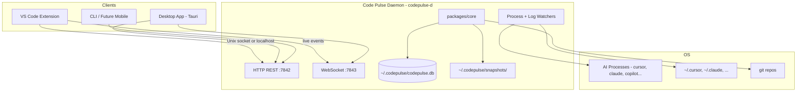
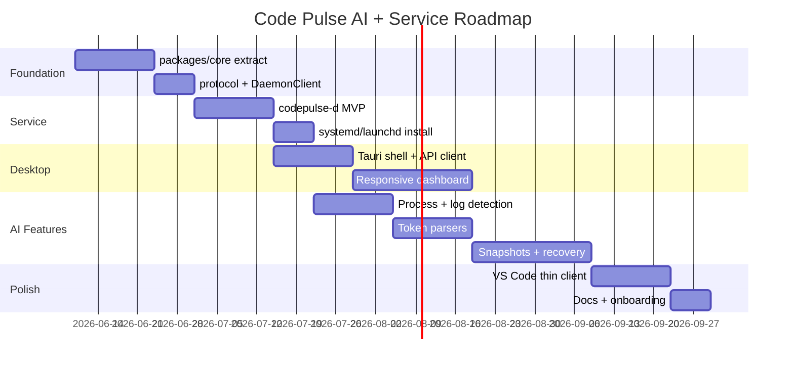

# Code Pulse — AI Analytics + Device Service + Desktop App

> **Status:** Planning (2026-06-09)  
> **Scope:** Transform Code Pulse from a VS Code-only extension into a **device-level local service** with a **responsive desktop app**, while adding **AI tool analytics**, **token tracking**, and **file recovery** — all 100% local.

---

## Executive Summary

Code Pulse today tracks coding time inside VS Code via `TimeTracker`, persists to SQLite (`DatabaseManager`), and optionally exposes a loopback REST API (`ApiServer`). The next evolution splits responsibilities:

| Layer | Role |
|-------|------|
| **Code Pulse Daemon** (`codepulse-d`) | Always-on device service — owns DB, AI/process monitoring, snapshots, aggregations |
| **VS Code Extension** (thin client) | Editor events, heartbeats, file context — pushes to daemon |
| **Desktop App** (`codepulse-app`) | Full responsive dashboard — reads daemon via HTTP + WebSocket |
| **Shared Core** (`packages/core`) | Business logic reused by all three |

**User story (Turkish origin):**  
*"VS Code'da ne kadar çalışıldığını hesaplayan bir proje; içine AI tool'larını analiz eden özellik — tüm process'leri inceleyen, ne kadar çalışıldığı ve ne kadar token kullanıldığı + mümkünse hangi dosya değişti (git diff tarzı). Yanlış bir şey yapanlar buradan kurtarabilsin. Tamamen local. Artı: cihazda servis olarak çalışsın ve responsive desktop app olsun."*

---

## Target Architecture



### Why a daemon?

| Capability | Extension-only | Daemon |
|------------|----------------|--------|
| Track AI CLI tools in terminal | Limited | Full process tree |
| Read `~/.cursor` / `~/.claude` logs | Needs FDA on macOS | Centralized permission UX |
| Survive VS Code restart | Session gaps | Continuous |
| Desktop app without VS Code open | No | Yes |
| File snapshots before AI edits | Partial | Full workspace watcher |
| Multiple VS Code windows/instances | Fragmented | Unified |

---

## Monorepo Layout (Proposed)

```
code-pulse/
├── packages/
│   ├── core/                    # Shared TS: DB, analytics, AI parsers, git diff
│   ├── protocol/                # OpenAPI + WebSocket event schemas (JSON Schema)
│   └── client/                  # Typed SDK for extension + desktop app
├── apps/
│   ├── daemon/                  # codepulse-d — Node or Rust service
│   ├── desktop/                 # Tauri 2 + React/Svelte responsive UI
│   └── vscode-extension/        # Current src/ migrated here (thin)
├── webview/                     # Legacy in-editor dashboard (optional, links to app)
└── docs/plans/
```

**Recommendation:** Start with **Node.js daemon** (reuse existing `sqlite3`, `DatabaseManager` logic) and migrate hot paths to Rust later if needed. **Tauri 2** for desktop — small binary, native menus, system tray.

---

## 18 Planning Perspectives (Agent Domains)

Each section below is an independent planning workstream. Implement in phases; no hard cross-dependencies except daemon + protocol first.

---

### 1. Device Service (`codepulse-d`)

**Goal:** Background service owning all state and watchers.

| Item | Detail |
|------|--------|
| Binary name | `codepulse-d` |
| Data dir | `~/.codepulse/` (macOS/Linux), `%USERPROFILE%\.codepulse\` (Windows) |
| Default ports | HTTP `7842`, WebSocket `7843` (avoid 8080 conflicts) |
| Install | `launchd` (macOS), `systemd --user` (Linux), Windows Service or Task Scheduler |
| Lifecycle | Auto-start on login; single-instance lock file |
| Health | `GET /health`, heartbeat file `~/.codepulse/daemon.pid` |

**Service responsibilities:**
- SQLite read/write (migrated from extension)
- AI process + log monitoring
- File snapshot engine
- Session aggregation + rollups
- Push events to connected clients via WebSocket

**VS Code extension changes:**
- On activate: discover daemon (`~/.codepulse/socket` or port file)
- If daemon missing: prompt "Install Code Pulse Service" (one-click script)
- Extension becomes event **producer** only; stop owning `DatabaseManager` directly when daemon connected

---

### 2. Desktop App (`codepulse-app`)

**Goal:** Responsive native dashboard — primary UI for AI recovery and analytics.

| Item | Choice |
|------|--------|
| Framework | **Tauri 2** + **Svelte** or React |
| Design | Mobile-first breakpoints: 320px (phone companion later), 768px tablet, 1024px+ desktop |
| System tray | Show today's time, current AI session, quick pause |
| Deep links | `codepulse://session/{id}`, `codepulse://recover/{snapshotId}` |
| Offline | Full UI works against local daemon; no cloud required |

**Key screens:**
1. **Home** — today stats, AI vs human split, live session
2. **Timeline** — unified coding + AI events
3. **Tokens** — usage by tool/model/day
4. **Files** — diff viewer + restore
5. **Projects** — per-repo breakdown
6. **Settings** — privacy tiers, retention, daemon status
7. **Recovery Center** — batch restore, preview, "undo AI session"

**Connection to VS Code:**
- "Open in VS Code" button → `vscode://file/{path}:{line}`
- Badge when extension connected vs daemon-only mode
- Extension status via `GET /clients` (lists connected VS Code instances)

---

### 3. Communication Protocol

**REST** (extend existing `ApiServer` routes):

| Endpoint | Purpose |
|----------|---------|
| `GET /v1/status` | Daemon version, uptime, connected clients |
| `GET /v1/current` | Active coding session |
| `GET /v1/sessions` | Paginated sessions |
| `GET /v1/ai/sessions` | AI-attributed sessions |
| `GET /v1/ai/tokens` | Token aggregates |
| `GET /v1/ai/tools` | Detected tools inventory |
| `GET /v1/snapshots` | List file snapshots |
| `GET /v1/snapshots/:id/diff` | Unified diff text |
| `POST /v1/snapshots/:id/restore` | Restore file(s) |
| `POST /v1/events/ingest` | Extension batch event upload |
| `GET /v1/ws` | WebSocket upgrade |

**WebSocket events** (server → clients):

```typescript
type DaemonEvent =
  | { type: 'session.started'; session: CodingSession }
  | { type: 'session.updated'; session: CodingSession }
  | { type: 'ai.tool.detected'; tool: string; confidence: number }
  | { type: 'ai.tokens'; usage: TokenUsage }
  | { type: 'file.snapshot'; snapshot: FileSnapshotMeta }
  | { type: 'client.connected'; client: 'vscode' | 'desktop'; id: string };
```

**Auth:** Unix domain socket (no token) on same machine; loopback HTTP uses auto-generated token in `~/.codepulse/token` (existing `localServer.apiToken` pattern).

**Package:** `packages/protocol` — JSON Schema + generated types for extension, daemon, desktop.

---

### 4. AI Tool Detection

**Module:** `packages/core/src/detectors/AIToolDetector.ts`

| Source | Method | Tools |
|--------|--------|-------|
| Process names | Poll `ps` / `/proc` every 5s | `cursor`, `Claude`, `copilot`, `aider`, `cody`, `windsurf`, `continue` |
| VS Code extensions | Extension ingests & reports | `github.copilot`, `continue.continue`, etc. |
| Terminal commands | Daemon parses shell history / PTY patterns | `claude`, `cursor-agent`, `aider` |
| Log directory watchers | `chokidar` on known paths | `~/.cursor/`, `~/.claude/`, `~/.continue/` |
| LM API | Extension hook `vscode.lm` | Chat model invocations |

**Confidence scoring:**

```
score = process_match(0.4) + log_activity(0.3) + extension_report(0.2) + terminal_match(0.1)
```

Threshold `≥ 0.5` → mark session as `ai_assisted`.

**Limitations (document honestly):**
- Sandboxed tools may hide process names
- Copilot has minimal local telemetry — often **estimated** tier
- macOS may require Full Disk Access for `~/.cursor` logs

---

### 5. Token Usage Tracking

**Module:** `packages/core/src/analytics/TokenAggregator.ts`

| Source | Accuracy | Fields |
|--------|----------|--------|
| Claude Code `~/.claude/` JSONL logs | **Exact** | `input_tokens`, `output_tokens`, `model` |
| Cursor usage exports / logs | **Exact–Estimated** | Varies by version |
| OpenAI-compatible local logs | **Exact** | If tool writes them |
| `vscode.lm` usage events | **Exact** | When available |
| Character heuristic | **Estimated** | `chars / 4` for missing data |

**Schema:** `ai_token_usage` table (see §6).

**Privacy rule:** Store counts + model name only. **Never** store prompts, responses, or API keys.

---

### 6. Database Schema v5

Bump `SCHEMA_VERSION` from 4 → 5 in daemon-owned DB.

```sql
-- AI session link (1:1 or N:1 with coding sessions)
CREATE TABLE ai_sessions (
    id TEXT PRIMARY KEY,
    session_id TEXT REFERENCES sessions(id) ON DELETE SET NULL,
    tool TEXT NOT NULL,           -- 'cursor' | 'claude-code' | 'copilot' | ...
    model TEXT,
    started_at TEXT NOT NULL,
    ended_at TEXT,
    confidence REAL DEFAULT 1.0,
    source TEXT,                  -- 'process' | 'log' | 'extension'
    created_at DATETIME DEFAULT CURRENT_TIMESTAMP
);

CREATE TABLE ai_tool_events (
    id INTEGER PRIMARY KEY AUTOINCREMENT,
    ai_session_id TEXT REFERENCES ai_sessions(id) ON DELETE CASCADE,
    event_type TEXT NOT NULL,     -- 'detected' | 'active' | 'idle'
    tool TEXT NOT NULL,
    metadata TEXT,                -- JSON, no prompts
    occurred_at TEXT NOT NULL
);

CREATE TABLE ai_token_usage (
    id INTEGER PRIMARY KEY AUTOINCREMENT,
    ai_session_id TEXT REFERENCES ai_sessions(id) ON DELETE CASCADE,
    model TEXT,
    input_tokens INTEGER DEFAULT 0,
    output_tokens INTEGER DEFAULT 0,
    estimated INTEGER DEFAULT 0,    -- 1 if heuristic
    recorded_at TEXT NOT NULL
);

CREATE TABLE file_snapshots (
    id TEXT PRIMARY KEY,
    ai_session_id TEXT REFERENCES ai_sessions(id) ON DELETE SET NULL,
    session_id TEXT REFERENCES sessions(id) ON DELETE SET NULL,
    project TEXT NOT NULL,
    file_path TEXT NOT NULL,
    snapshot_type TEXT NOT NULL,  -- 'pre_ai' | 'checkpoint' | 'post_ai'
    diff_path TEXT,               -- path to unified diff blob on disk
    file_hash_before TEXT,
    file_hash_after TEXT,
    size_bytes INTEGER,
    created_at DATETIME DEFAULT CURRENT_TIMESTAMP
);

CREATE TABLE ai_process_runs (
    id INTEGER PRIMARY KEY AUTOINCREMENT,
    pid INTEGER,
    process_name TEXT,
    tool TEXT,
    started_at TEXT,
    ended_at TEXT,
    cpu_ms INTEGER,
    parent_pid INTEGER
);

CREATE TABLE connected_clients (
    id TEXT PRIMARY KEY,
    client_type TEXT NOT NULL,    -- 'vscode' | 'desktop' | 'cli'
    version TEXT,
    connected_at TEXT,
    last_seen_at TEXT
);

CREATE INDEX idx_ai_sessions_session ON ai_sessions(session_id);
CREATE INDEX idx_snapshots_ai_session ON file_snapshots(ai_session_id);
CREATE INDEX idx_snapshots_file ON file_snapshots(file_path);
```

**Daily rollups:** Add optional `ai_daily_rollups` or extend `daily_rollups` with `ai_active_ms`, `tokens_in`, `tokens_out`.

---

### 7. File Snapshot & Recovery

**Module:** `packages/core/src/snapshots/SnapshotManager.ts`

**When to snapshot:**
1. AI tool confidence crosses 0.5 (pre-AI baseline)
2. Every N minutes during active AI session (checkpoint)
3. On file save while AI active (post-change)
4. On user command "Protect this file"

**Storage:**
- Metadata in `file_snapshots` table
- Diff blobs in `~/.codepulse/snapshots/{id}.diff`
- Max 500 MB per project (configurable), LRU prune

**Recovery flows:**
| Action | Command |
|--------|---------|
| Preview diff | Desktop app or `codepulse.showAISessionDiff` |
| Restore one file | `POST /v1/snapshots/:id/restore` |
| Undo entire AI session | Restore all snapshots linked to `ai_session_id` |
| Export recovery bundle | Zip of diffs + manifest JSON |

**Git integration:** Prefer `git diff HEAD -- path` when repo clean; fall back to raw file copy when not a git repo.

---

### 8. Git Diff & Attribution

**Module:** `packages/core/src/git/GitDiffService.ts`

Extends existing git correlation plan (`docs/superpowers/plans/2026-04-12-04-git-correlation.md`).

**Attribution heuristic:**
```
if ai_tool_active AND file_changed_within(window=30s):
    attribute_change_to = 'ai'
else:
    attribute_change_to = 'human'
```

**Edge cases:**
- Dirty tree → use snapshot diff, not `git diff`
- No git repo → file hash comparison only
- Merge conflicts → flag as non-recoverable auto, manual only

---

### 9. VS Code Extension Integration (Thin Client)

**Changes to `extension.ts`:**

1. `DaemonClient.connect()` on activate
2. Replace direct `DatabaseManager` writes with `client.ingest(events)`
3. Keep local fallback if daemon offline (degraded mode)
4. Register `vscode.lm` listeners → forward to daemon
5. Report installed AI-related extensions on startup

**New commands:**
- `codepulse.openDesktopApp`
- `codepulse.showAISessionDiff`
- `codepulse.restoreFromSnapshot`
- `codepulse.installDaemon`

**Status bar:** Show AI tool icon when active session is AI-assisted.

---

### 10. Desktop UI — Responsive Design

**Breakpoints:**
| Name | Width | Layout |
|------|-------|--------|
| `compact` | < 640px | Single column, bottom nav |
| `medium` | 640–1024px | Two column, collapsible sidebar |
| `wide` | > 1024px | Three column, persistent sidebar |

**Components (reuse dashboard concepts from `webview/dashboard.js`):**
- `AiTimeline` — vertical event stream
- `TokenChart` — Chart.js stacked bar by model
- `DiffViewer` — monospace, split/unified toggle
- `RecoveryPanel` — checkbox multi-select + restore CTA
- `DaemonStatus` — green/amber/red connection indicator

**Theming:** System light/dark + respect OS accent; no hardcoded colors (mirror `cssVar('--vscode-*')` semantics as CSS variables in app).

---

### 11. Privacy & Security Model

| Data | Default | Config key |
|------|---------|------------|
| Session timing | On | `codepulse.enabled` |
| AI tool name | On | `codepulse.ai.trackTools` |
| Token counts | On | `codepulse.ai.trackTokens` |
| Filenames in snapshots | Opt-in | `codepulse.ai.snapshots.includeFilenames` |
| Diff content | Opt-in | `codepulse.ai.snapshots.storeDiffs` |
| Prompts/responses | **Never** | — |
| Cloud sync of AI data | **Off** | `codepulse.sync.includeAiData` default `false` |

**Threat mitigations:**
- Loopback-only by default
- Audit log table `privacy_audit` for every external path read
- One-click "Delete all AI data"
- Optional AES-256 encryption for snapshot dir (`codepulse.ai.encryptSnapshots`)

**macOS:** Single FDA prompt during daemon install, explained in plain language.

---

### 12. Process Monitoring (OS-Level)

**Module:** `packages/core/src/watchers/ProcessWatcher.ts`

| OS | API |
|----|-----|
| macOS | `ps -eo pid,ppid,comm` + optional `libproc` via native addon |
| Linux | `/proc/{pid}/stat`, `cmdline` |
| Windows | `wmic process` or PowerShell `Get-Process` |

**Watch list (configurable):**
```json
{
  "codepulse.ai.processPatterns": [
    "cursor", "Claude", "copilot", "aider",
    "cody", "windsurf", "continue", "ollama"
  ]
}
```

**Rate limit:** Poll every 5s; backoff to 30s when idle.

---

### 13. Log Parsers

| Tool | Log path | Parser |
|------|----------|--------|
| Claude Code | `~/.claude/projects/**/*.jsonl` | `ClaudeLogParser` — stream tail |
| Cursor | `~/.cursor/` (version-dependent) | `CursorLogParser` |
| Continue | `~/.continue/dev_data/` | `ContinueLogParser` |
| Aider | `.aider.chat.history.md` in project | Per-repo watcher |

**Pattern:** Tail + incremental parse; store cursor offset in `parser_cursors` table.

---

### 14. Performance & Resource Budget

| Resource | Budget |
|----------|--------|
| Daemon RAM | < 80 MB idle, < 150 MB active |
| CPU | < 2% average on M1 Mac |
| Disk | 500 MB snapshots default cap |
| DB size | Warn at 1 GB, prune rollups > 365 days |
| Extension IPC | Batch events every 2s, max 50 KB payload |

**When VS Code disconnected:** Daemon continues AI monitoring for CLI tools.

---

### 15. Testing Strategy

| Layer | Tests |
|-------|-------|
| `packages/core` | Unit: parsers, attribution, schema migrations |
| `apps/daemon` | Integration: HTTP + WS, multi-client |
| `apps/desktop` | Component + E2E (Playwright via Tauri) |
| Extension | Existing Mocha suite + mock `DaemonClient` |
| Fixtures | Sample Claude/Cursor JSONL in `test/fixtures/ai-logs/` |

**CI:** `npm run ci` per package; daemon integration on Linux runner.

---

### 16. Migration Path (Current → Target)

| Phase | Deliverable | Breaking? |
|-------|-------------|-----------|
| **0** | Extract `packages/core` from `src/` | No |
| **1** | `codepulse-d` daemon + protocol | No — extension fallback |
| **2** | Desktop app MVP (stats + timeline) | No |
| **3** | AI detection + token tracking | No — opt-in |
| **4** | Snapshots + recovery UI | No — opt-in |
| **5** | Extension thin-client only (optional) | Config flag |

**DB migration:** Extension DB at `globalStorageUri` → import tool on first daemon start.

---

### 17. Configuration Reference (`codepulse.ai.*`)

```jsonc
{
  "codepulse.daemon.enabled": true,
  "codepulse.daemon.port": 7842,
  "codepulse.daemon.autoStart": true,

  "codepulse.ai.enabled": true,
  "codepulse.ai.trackTools": true,
  "codepulse.ai.trackTokens": true,
  "codepulse.ai.processPollingMs": 5000,
  "codepulse.ai.logWatchPaths": [],          // extra paths
  "codepulse.ai.snapshots.enabled": true,
  "codepulse.ai.snapshots.storeDiffs": true,
  "codepulse.ai.snapshots.maxMbPerProject": 500,
  "codepulse.ai.snapshots.retentionDays": 30,
  "codepulse.ai.encryptSnapshots": false,

  "codepulse.desktop.openOnStartup": false,
  "codepulse.desktop.minimizeToTray": true
}
```

---

### 18. Implementation Roadmap



**Estimated total:** ~16–20 weeks with 1–2 developers.

---

## Phase 1 MVP (Ship First)

Minimum viable slice to validate architecture:

1. **`codepulse-d`** — HTTP API mirroring current `ApiServer` + WebSocket `session.updated`
2. **Desktop app** — Home + Timeline + connection status
3. **Extension** — `DaemonClient` with fallback to embedded mode
4. **AI MVP** — Process detection only (Cursor + Claude Code binary names)
5. **No snapshots yet** — defer to Phase 2

**MVP success criteria:**
- [ ] Daemon runs on login, survives VS Code quit
- [ ] Desktop app shows live session within 2s
- [ ] Extension and desktop show same totals
- [ ] AI tool badge appears when Claude Code process detected
- [ ] All data in `~/.codepulse/`, zero network calls

---

## Open Decisions

| # | Question | Options | Recommendation |
|---|----------|---------|----------------|
| 1 | Daemon runtime | Node vs Rust | **Node first** (reuse code), Rust later |
| 2 | Desktop framework | Tauri vs Electron | **Tauri 2** (size + perf) |
| 3 | UI framework | Svelte vs React | **Svelte** (smaller bundle) |
| 4 | IPC transport | HTTP+WS vs gRPC | **HTTP+WS** (debuggable) |
| 5 | In-editor dashboard | Keep vs deprecate | **Keep** as lightweight; desktop = full UX |
| 6 | Mobile companion | Phase 3+ | Same API, responsive web or native later |

---

## Appendix A — AI Tool Inventory

| Tool | Process | VS Code ext | Log path | Token data |
|------|---------|-------------|----------|------------|
| Cursor | `Cursor`, `cursor-agent` | Built-in | `~/.cursor/` | Partial |
| Claude Code | `claude` | N/A (CLI) | `~/.claude/` | Exact |
| GitHub Copilot | — | `github.copilot` | Limited | Estimated |
| Continue | — | `continue.continue` | `~/.continue/` | Partial |
| Cody | `cody` | `sourcegraph.cody` | — | Partial |
| Windsurf | `windsurf` | Built-in | — | Partial |
| Aider | `aider` | — | `.aider.*` in repo | Estimated |

---

## Appendix B — Existing Code Hooks

| File | Role in new architecture |
|------|--------------------------|
| `src/api/ApiServer.ts` | Becomes daemon HTTP layer template |
| `src/tracker/TimeTracker.ts` | Move to `packages/core`, emit events |
| `src/storage/DatabaseManager.ts` | Move to `packages/core`, schema v5 |
| `src/ui/WebviewProvider.ts` | Thin client or embed desktop via webview |
| `src/extension.ts` | DaemonClient wiring |

---

## Appendix C — Recovery UX Copy

> **Recovery Center**  
> "AI tools edited 4 files in the last session. Review changes and restore any file to its pre-AI state. All data stays on your machine."

---

*This plan synthesizes 18 parallel planning domains: device service, desktop app, protocol, AI detection, tokens, snapshots, git diff, schema, VS Code integration, UI, privacy, process monitoring, log parsers, performance, testing, migration, configuration, and roadmap.*