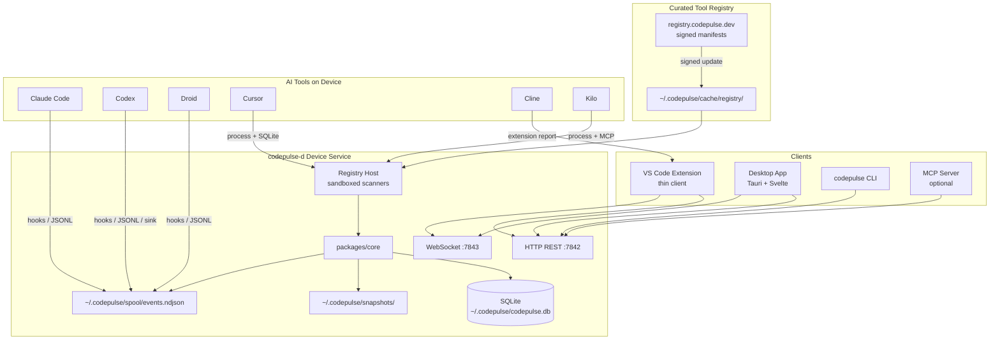
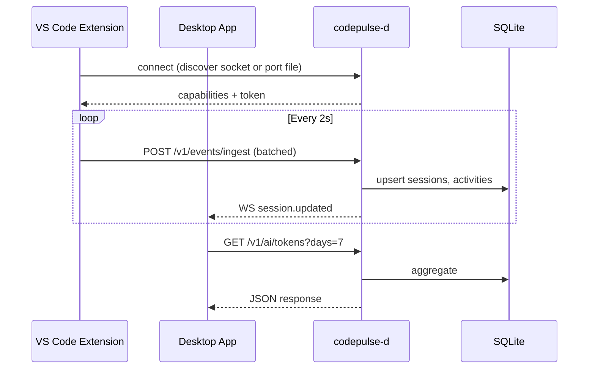
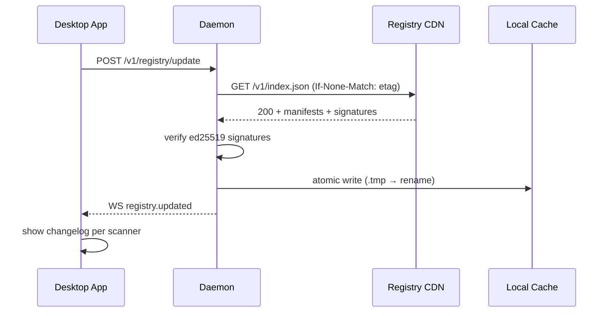
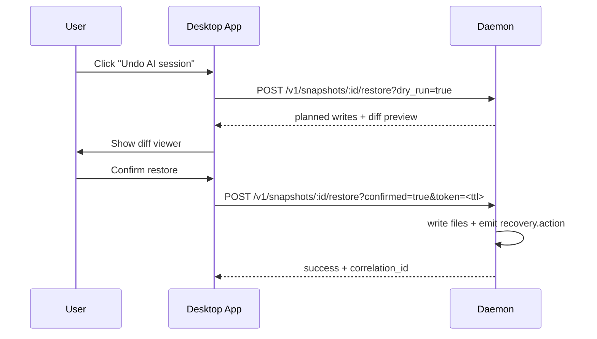
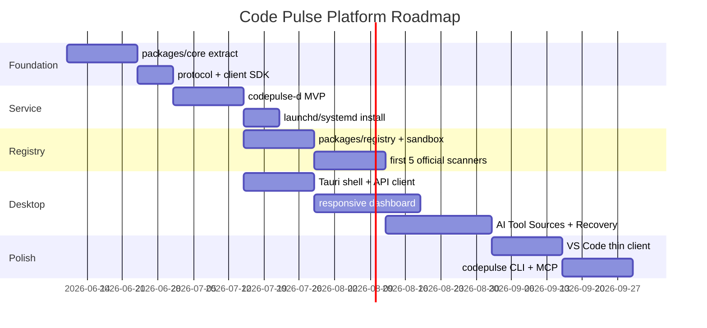

# Code Pulse Platform Strategy

## Local AI Observability, Curated Tool Registry & Device-Native Architecture

| | |
|---|---|
| **Version** | 1.0 |
| **Date** | 2026-06-09 |
| **Status** | Strategic planning — ready for implementation |
| **Audience** | Core team, implementers, reviewers |
| **Related** | [`2026-06-09-ai-analytics-device-service-plan.md`](../plans/2026-06-09-ai-analytics-device-service-plan.md) |

---

## Table of Contents

1. [Executive Summary](#1-executive-summary)
2. [Problem & Vision](#2-problem--vision)
3. [Platform Architecture](#3-platform-architecture)
4. [Curated Tool Registry](#4-curated-tool-registry)
5. [AI Tool Scanner Catalog](#5-ai-tool-scanner-catalog)
6. [Event Protocol & Data Model](#6-event-protocol--data-model)
7. [Recovery & Snapshot System](#7-recovery--snapshot-system)
8. [Privacy & Trust Model](#8-privacy--trust-model)
9. [Desktop App Experience](#9-desktop-app-experience)
10. [Component Inventory](#10-component-inventory)
11. [CLI Consultation Synthesis](#11-cli-consultation-synthesis)
12. [Implementation Roadmap](#12-implementation-roadmap)
13. [Open Decisions](#13-open-decisions)
14. [Appendices](#14-appendices)

---

## 1. Executive Summary

Code Pulse is evolving from a VS Code time-tracking extension into a **device-native developer observability platform**. The platform answers four questions developers increasingly cannot answer about their own workflow:

1. **How long did I actually work** — in the editor, in the terminal, with AI tools?
2. **How much AI did I use** — which tools, which models, how many tokens?
3. **What changed** — which files were touched, by human or by AI?
4. **Can I undo it** — if an AI session went wrong, can I recover locally?

Everything stays **100% local by default**. No prompts, no responses, no source code leaves the machine unless the user explicitly opts in.

### Strategic pillars

| Pillar | Description |
|--------|-------------|
| **Device service** | `codepulse-d` runs as an always-on daemon — survives VS Code restarts, owns the database |
| **Responsive desktop app** | Tauri-based native UI — primary surface for analytics, recovery, and registry management |
| **Thin VS Code extension** | Editor event producer — heartbeats, file context, `vscode.lm` hooks |
| **Curated Tool Registry** | We test, approve, and ship scanner definitions; users enable only what they want scanned |

### Origin story

> *"VS Code'da ne kadar çalışıldığını hesaplayan bir proje; içine AI tool'larını analiz eden özellik — tüm process'leri inceleyen, ne kadar çalışıldığı ve ne kadar token kullanıldığı + mümkünse hangi dosya değişti (git diff tarzı). Yanlış bir şey yapanlar buradan kurtarabilsin. Tamamen local. Artı: cihazda servis olarak çalışsın ve responsive desktop app olsun."*

### What makes this different

| Existing tools | Code Pulse |
|----------------|------------|
| WakaTime — time only, no AI | AI + human attribution |
| Cursor usage dashboard — cloud, single tool | Multi-tool, local, curated |
| Git history — no token/cost data | Unified timeline: time + tokens + diffs |
| Manual `git stash` recovery | One-click "Undo AI session" with preview |

---

## 2. Problem & Vision

### The problem

AI coding assistants (Claude Code, Codex, Cursor, Droid, Cline, Kilo, and dozens more) now modify code autonomously. Developers face a new class of failure:

- An agent refactors the wrong module
- Token costs spike unnoticed over a week
- Multiple tools run in parallel with no unified view
- Recovery requires manual `git diff` archaeology across sessions

No single tool today provides **cross-tool, local, privacy-respecting observability with recovery**.

### The vision

```
┌─────────────────────────────────────────────────────────────┐
│                    Code Pulse Platform                       │
│                                                              │
│   "Know what you built, know what AI built, undo either."   │
│                                                              │
│   Local-first · Curated · Recoverable · Transparent          │
└─────────────────────────────────────────────────────────────┘
```

### Success criteria

- [ ] Daemon runs on login; data persists across VS Code restarts
- [ ] Desktop app and extension show identical totals within 2 seconds
- [ ] Approved AI tools detected with ≥ 90% accuracy for hook-enabled tools
- [ ] Token counts available for Claude Code and Codex (exact tier)
- [ ] File restore preview works before any write
- [ ] Zero outbound network calls with default configuration
- [ ] User can audit exactly what each scanner read

---

## 3. Platform Architecture

### 3.1 System diagram



### 3.2 Why a daemon?

| Capability | Extension-only (today) | Device service (target) |
|------------|------------------------|-------------------------|
| Track AI CLI in terminal | Limited | Full process tree |
| Read `~/.cursor` / `~/.claude` logs | Fragmented permissions | Single FDA prompt at install |
| Survive VS Code restart | Session gaps | Continuous |
| Desktop without VS Code | Impossible | Native dashboard |
| Multi-window VS Code | Fragmented sessions | Unified |
| Hook forwarding from Droid/Claude | Not possible | Central spool |
| Registry scanner sandbox | Not possible | Worker-thread isolation |

### 3.3 Monorepo layout

```
code-pulse/
├── packages/
│   ├── core/                 # DB, analytics, parsers, git diff, snapshots
│   ├── protocol/             # Event envelope, Zod schemas, scanner manifest
│   ├── registry/             # Scanner interface, LocalRegistry, sandbox host
│   └── client/               # Typed SDK for extension, desktop, CLI
├── apps/
│   ├── daemon/               # codepulse-d — Node service (Rust later if needed)
│   ├── desktop/              # Tauri 2 + Svelte responsive app
│   └── vscode-extension/     # Current src/ migrated (thin client)
├── hooks/                    # Forwarder scripts installed into AI tool hook dirs
├── docs/
│   ├── plans/
│   └── reports/              # ← this document
└── test/fixtures/ai-logs/    # Sample JSONL for parser tests
```

### 3.4 Communication protocol

**REST** (extend existing `ApiServer` pattern):

| Endpoint | Method | Purpose |
|----------|--------|---------|
| `/v1/status` | GET | Daemon version, uptime, connected clients |
| `/v1/capabilities` | GET | Feature set for graceful client degradation |
| `/v1/current` | GET | Active coding session |
| `/v1/sessions` | GET | Paginated sessions |
| `/v1/ai/sessions` | GET | AI-attributed sessions |
| `/v1/ai/tokens` | GET | Token aggregates by tool/model/day |
| `/v1/ai/tools` | GET | Enabled scanners + last scan time |
| `/v1/registry` | GET | Installed scanner manifests |
| `/v1/registry/update` | POST | Fetch and verify new registry index |
| `/v1/snapshots` | GET | List file snapshots |
| `/v1/snapshots/:id/diff` | GET | Unified diff text |
| `/v1/snapshots/:id/restore` | POST | Restore (dry-run or confirmed) |
| `/v1/events/ingest` | POST | Extension batch event upload |
| `/v1/metrics` | GET | Scanner health (local Prometheus-style) |
| `/v1/health` | GET | Liveness probe |

**WebSocket** (`:7843`) — server pushes versioned envelopes (see §6).

**Auth:** Unix domain socket preferred on same machine; loopback HTTP uses auto-generated token in `~/.codepulse/token`.

### 3.5 Client connection model



---

## 4. Curated Tool Registry

### 4.1 Concept

The registry is the **controlled update channel** for AI tool scanners. Instead of hard-coding detection logic in the daemon and shipping a full app update for every new AI tool, we ship **signed scanner manifests** that the daemon downloads, verifies, and loads at runtime.

```
┌──────────┐    test & approve    ┌──────────────┐    signed push    ┌─────────────┐
│ Code     │ ──────────────────►  │   Registry   │ ────────────────► │   Daemon    │
│ Pulse    │                      │   (CDN/Git)  │                   │  (local)    │
│ Team     │                      └──────────────┘                   └──────┬──────┘
└──────────┘                                                               │
                                                                           ▼
                                                              ┌────────────────────────┐
                                                              │ User enables scanner   │
                                                              │ in Desktop App → scan  │
                                                              └────────────────────────┘
```

**Key principle:** Unapproved tools are **invisible by default**. The daemon does not perform generic application inventory or path exfiltration. Users may optionally count anonymous "unknown coding activity" if they opt in.

### 4.2 Scanner manifest schema

```json
{
  "$schema": "https://registry.codepulse.dev/v1/scanner.schema.json",
  "id": "scn.claude-code",
  "version": "1.4.2",
  "displayName": "Claude Code",
  "publisher": "code-pulse-official",
  "trust": "official",
  "minDaemon": "0.9.0",
  "minProtocol": "5.1",
  "capabilities": ["process", "log", "hook"],
  "processPatterns": ["claude", "Claude"],
  "logPaths": [
    {
      "glob": "~/.claude/projects/**/*.jsonl",
      "parser": "claude-jsonl-v2",
      "watchMode": "tail"
    },
    {
      "glob": "~/.claude/metrics/costs.jsonl",
      "parser": "claude-costs-v1",
      "watchMode": "tail"
    }
  ],
  "hookInstaller": {
    "configPath": "~/.claude/settings.json",
    "forwarder": "~/.codepulse/hooks/claude-forward.sh",
    "events": ["PreToolUse", "PostToolUse", "SessionStart", "Stop"]
  },
  "tokenFields": {
    "input": "input_tokens",
    "output": "output_tokens",
    "cacheRead": "cache_read_input_tokens",
    "cacheWrite": "cache_creation_input_tokens",
    "model": "model"
  },
  "fileChangeTools": ["Write", "Edit", "MultiEdit"],
  "allowedFields": ["session_id", "tool_name", "duration_ms", "token_counts", "file_path_hash"],
  "redactedFields": ["prompt", "response", "tool_input.content"],
  "contentPolicy": "metadata-only",
  "signature": "ed25519:5123abcdef…",
  "bundleHash": "sha256:abc123…"
}
```

### 4.3 Trust tiers

| Tier | Update behavior | UX |
|------|-----------------|-----|
| `official` | Silent update on registry fetch | Badge: green checkmark |
| `verified` | Prompt once per publisher | Badge: blue shield |
| `community` | Off by default; explicit enable | Badge: gray, warning |

Desktop app **AI Tool Sources** screen always shows: `scanner_id`, `version`, `last_run`, `evidence_count`, `trust`.

### 4.4 Scanner runtime

Scanners never run as arbitrary `eval()`. The registry host:

1. Verifies `ed25519` signature against pinned root key (bundled in `codepulse-d` at build time)
2. Checks `minDaemon` / `minProtocol` compatibility
3. Rejects rollbacks older than installed version (opt-in downgrade via CLI flag)
4. Loads parser bundle into `worker_threads` with resource limits:
   - `maxOldGenerationSizeMb: 64`
   - Wall-clock timeout: 1500 ms per match
5. Passes only **facade handles** (`LogReader`, `FsReader`) — deny-by-default path access

```typescript
// packages/registry/src/Scanner.ts
export interface Scanner {
  id: string;
  version: string;
  capabilities: ('process' | 'log' | 'hook' | 'extension' | 'terminal' | 'lm')[];
  match(ctx: ScanContext): Promise<ScanResult>;
}

export interface ScanResult {
  tool: string;
  confidence: number;       // 0.0 – 1.0
  evidence: Evidence[];     // typed, no raw content
  sessionId?: string;
}

export interface Evidence {
  type: 'process' | 'log_line' | 'hook_event' | 'extension_report';
  timestamp: string;
  hash: string;             // content hash for dedup, not content itself
}
```

### 4.5 Confidence scoring

```
confidence = process_match(0.4)
           + log_activity(0.3)
           + extension_report(0.2)
           + terminal_match(0.1)

threshold ≥ 0.5 → session tagged ai_assisted
```

### 4.6 Registry update flow



Offline resilience: full registry mirror at `~/.codepulse/cache/registry/`. Dead network does not brick the daemon.

### 4.7 Hook-first, scrape-second

Consensus from all consulted AI tools:

| Priority | Source | Reliability |
|----------|--------|-------------|
| 1 | Native hooks (`PreToolUse`, `SessionEnd`, etc.) | Highest — structured JSON on stdin |
| 2 | `CODE_PULSE_EVENT_SINK` env (NDJSON/UDS) | High — first-party emit surface |
| 3 | Append-only observability file per session | High — versioned contract |
| 4 | Log tail (`~/.claude/projects/*.jsonl`) | Medium — format may shift |
| 5 | Process name polling | Low — sandboxed tools hide names |

### 4.8 Quarantine & health

If a parser produces malformed events or spikes volume:

1. Disable that scanner locally
2. Emit minimal `scanner.quarantined` diagnostic event
3. Surface in desktop app with "Report issue" link
4. Auto-retry on next registry update if `bundleHash` changed

---

## 5. AI Tool Scanner Catalog

Per-tool specifications validated on a developer machine (macOS, 2026-06-09). These become the first `official` registry entries.

### 5.1 Summary table

| Tool | Process | Primary signal | Token accuracy | Recovery hook |
|------|---------|----------------|----------------|---------------|
| Claude Code | `claude` | Hooks + JSONL | **Exact** | `PreToolUse` → snapshot |
| Codex | `codex` | JSONL rollouts + hooks | **Exact** | `CODE_PULSE_EVENT_SINK` |
| Droid (Factory) | `droid` | Hooks + session JSONL | **Exact** (transcript) | `PreToolUse` on Write/Edit |
| Cursor | `Cursor` | Process + SQLite DB | Partial | File watcher |
| Cline | `cline` | Extension report + logs | Partial | Checkpoint API |
| Kilo | `kilo` | Process + MCP/ACP | Partial | MCP event |
| Agy | `agy` | Process + log tail | Estimated | Log parser |
| GitHub Copilot | — | VS Code extension ID | Estimated | Extension report |

### 5.2 Claude Code

| Field | Value |
|-------|-------|
| Scanner ID | `scn.claude-code` |
| Log paths | `~/.claude/projects/**/*.jsonl`, `~/.claude/metrics/costs.jsonl` |
| Hook events | `PreToolUse`, `PostToolUse`, `SessionStart`, `Stop`, `SubagentStop` |
| Daemon command | `claude daemon status` (background supervisor exists) |
| Token fields | `input_tokens`, `output_tokens`, `cache_read_input_tokens`, `cache_creation_input_tokens` |
| Recommended emit | `~/.claude/observability/<session_id>.ndjson` (proposed stable surface) |

**Claude Code's recommendation:** Use hook lifecycle as primary source; transcript tailing is fallback only. Pin approval by manifest hash, not by reverse-engineering internals.

### 5.3 OpenAI Codex

| Field | Value |
|-------|-------|
| Scanner ID | `scn.openai-codex` |
| Log paths | `~/.codex/archived_sessions/*.jsonl`, `~/.codex/sessions/` |
| Config | `~/.codex/config.toml` |
| Session format | `session_meta` + rollout events in JSONL |
| Token fields | Embedded in rollout response events |
| Recommended emit | `CODE_PULSE_EVENT_SINK` → `~/.codepulse/spool/events.ndjson` |

**Codex's recommendation:** Signed registry with `evidence_type` + `confidence` on every observation. Staged rollout with parser health metrics.

### 5.4 Droid (Factory)

| Field | Value |
|-------|-------|
| Scanner ID | `scn.factory-droid` |
| Log paths | `~/.factory/sessions/**/*.jsonl` |
| Hook config | `~/.factory/hooks.json` |
| Hook stdin | `tool_name`, `session_id`, `cwd`, `tool_input`, `hook_event_name` |
| SessionEnd extras | `transcript_path`, `reason` |
| File change tools | `Write`, `Edit`, `Bash` |

**Droid's recommendation:** Install `~/.codepulse/hooks/droid-forward.sh` via registry `hookInstaller`. On `PreToolUse` for `Write`/`Edit`, capture file hash before mutation — ideal `pre_ai` snapshot trigger.

### 5.5 Cursor

| Field | Value |
|-------|-------|
| Scanner ID | `scn.cursor-ide` |
| Data path | `~/.cursor/ai-tracking/` (SQLite: `ai-code-tracking.db`) |
| Process | `Cursor`, `cursor-agent` |
| Token accuracy | Partial — varies by Cursor version |
| Note | macOS may require Full Disk Access for `~/.cursor` |

### 5.6 Cline

| Field | Value |
|-------|-------|
| Scanner ID | `scn.cline` |
| CLI binary | `cline` (also VS Code extension `saoudrizwan.claude-dev`) |
| Data paths | `~/.cline/data/logs/`, `globalState.json` |
| Enterprise option | OpenTelemetry export (opt-in, for teams) |
| Privacy default | No code, no paths, no prompts in telemetry |

**Cline's recommendation:** Zod-validated envelope at daemon boundary. Dry-run restore with 60s TTL confirmation token. Four privacy tiers surfaced in desktop app.

### 5.7 Kilo

| Field | Value |
|-------|-------|
| Scanner ID | `scn.kilo` |
| CLI modes | TUI (`kilo`), ACP server (`kilo acp`), MCP (`kilo mcp`) |
| Integration | Process detection + optional MCP event subscription |
| Recommendation | Expose session events via MCP for cross-agent queries |

### 5.8 Agy

| Field | Value |
|-------|-------|
| Scanner ID | `scn.agy` |
| Process | `agy` |
| Log override | `--log-file <path>` |
| Non-interactive | `agy --print "<prompt>"` |
| Token accuracy | Estimated (chars/4 fallback) |

---

## 6. Event Protocol & Data Model

### 6.1 Versioned envelope

Every WebSocket message and spool line uses a common wrapper:

```typescript
interface Envelope<T extends DaemonEvent> {
  v: 1;                                              // envelope version
  id: string;                                        // ULID — idempotent ingest
  ts: number;                                        // ms since epoch
  src: 'daemon' | 'vscode' | 'desktop' | 'cli' | 'scanner';
  corr?: string;                                     // correlates request ↔ response
  type: T['type'];
  payload: T;
}
```

Bump `v` on breaking changes. Bump payload `type` literal for additive changes. Version envelopes from day one — retrofitting is expensive.

### 6.2 Core event types

```typescript
type DaemonEvent =
  | { type: 'session.started';     session: CodingSession }
  | { type: 'session.updated';     session: CodingSession }
  | { type: 'session.ended';       session: CodingSession }
  | { type: 'ai.tool.detected';    tool: string; confidence: number; evidence: Evidence[] }
  | { type: 'ai.session.started';  aiSession: AISession }
  | { type: 'ai.session.ended';    aiSession: AISession }
  | { type: 'ai.tokens';           usage: TokenUsage }
  | { type: 'file.snapshot';       snapshot: FileSnapshotMeta }
  | { type: 'file.change';         change: FileChangeMeta }
  | { type: 'recovery.action';     action: RecoveryAction }
  | { type: 'registry.updated';    scanners: ScannerManifestSummary[] }
  | { type: 'scanner.quarantined'; scannerId: string; reason: string }
  | { type: 'client.connected';    client: ClientInfo };
```

### 6.3 Token normalization

```typescript
interface TokenUsage {
  inputTokens: number;
  outputTokens: number;
  cacheReadTokens?: number;
  cacheWriteTokens?: number;
  reasoningTokens?: number;
  totalTokens: number;
  model?: string;
  currency?: string;
  estimatedCost?: number;
  isEstimated: boolean;    // true when heuristic, false when exact
}
```

Store nulls for missing breakdowns. Sum at query time, not ingest time. **Never** store prompt or response text.

### 6.4 File change attribution

```typescript
interface FileChangeMeta {
  pathHash: string;          // HMAC(path, per_install_salt)
  repoRootHash?: string;
  changeType: 'create' | 'modify' | 'delete';
  linesAdded: number;
  linesRemoved: number;
  language?: string;
  aiAttributed: boolean;     // captured at hook time — highest value field
  aiSessionId?: string;
}
```

### 6.5 Database schema v5

Daemon-owned SQLite at `~/.codepulse/codepulse.db`. Bump from current `SCHEMA_VERSION = 4`.

```sql
-- AI session (links to coding session or standalone)
CREATE TABLE ai_sessions (
    id TEXT PRIMARY KEY,
    session_id TEXT REFERENCES sessions(id) ON DELETE SET NULL,
    scanner_id TEXT NOT NULL,
    tool TEXT NOT NULL,
    model TEXT,
    started_at TEXT NOT NULL,
    ended_at TEXT,
    confidence REAL DEFAULT 1.0,
    source TEXT,
    created_at DATETIME DEFAULT CURRENT_TIMESTAMP
);

CREATE TABLE ai_tool_events (
    id INTEGER PRIMARY KEY AUTOINCREMENT,
    ai_session_id TEXT REFERENCES ai_sessions(id) ON DELETE CASCADE,
    event_type TEXT NOT NULL,
    tool TEXT NOT NULL,
    metadata TEXT,
    occurred_at TEXT NOT NULL
);

CREATE TABLE ai_token_usage (
    id INTEGER PRIMARY KEY AUTOINCREMENT,
    ai_session_id TEXT REFERENCES ai_sessions(id) ON DELETE CASCADE,
    model TEXT,
    input_tokens INTEGER DEFAULT 0,
    output_tokens INTEGER DEFAULT 0,
    cache_read_tokens INTEGER DEFAULT 0,
    cache_write_tokens INTEGER DEFAULT 0,
    estimated INTEGER DEFAULT 0,
    recorded_at TEXT NOT NULL
);

CREATE TABLE file_snapshots (
    id TEXT PRIMARY KEY,
    ai_session_id TEXT REFERENCES ai_sessions(id) ON DELETE SET NULL,
    session_id TEXT REFERENCES sessions(id) ON DELETE SET NULL,
    project TEXT NOT NULL,
    file_path TEXT NOT NULL,
    snapshot_type TEXT NOT NULL,
    diff_path TEXT,
    file_hash_before TEXT,
    file_hash_after TEXT,
    size_bytes INTEGER,
    created_at DATETIME DEFAULT CURRENT_TIMESTAMP
);

CREATE TABLE registry_scanners (
    id TEXT PRIMARY KEY,
    version TEXT NOT NULL,
    trust TEXT NOT NULL,
    enabled INTEGER DEFAULT 0,
    installed_at TEXT,
    last_scan_at TEXT,
    manifest_hash TEXT NOT NULL
);

CREATE TABLE parser_cursors (
    scanner_id TEXT NOT NULL,
    log_glob TEXT NOT NULL,
    byte_offset INTEGER DEFAULT 0,
    inode TEXT,
    last_event_id TEXT,
    PRIMARY KEY (scanner_id, log_glob)
);

CREATE TABLE privacy_audit (
    id INTEGER PRIMARY KEY AUTOINCREMENT,
    actor TEXT NOT NULL,
    operation TEXT NOT NULL,
    target_hash TEXT,
    occurred_at TEXT NOT NULL
);

CREATE INDEX idx_ai_sessions_session ON ai_sessions(session_id);
CREATE INDEX idx_snapshots_ai_session ON file_snapshots(ai_session_id);
CREATE INDEX idx_snapshots_file ON file_snapshots(file_path);
```

### 6.6 Ingestion guarantees

- **Idempotent:** dedupe on `event_id`
- **Append-only spool:** `~/.codepulse/spool/events.ndjson` with per-scanner cursors
- **Replay:** on daemon restart, re-parse from last cursor; emit `recovered: true` preserving original timestamps
- **Validation:** Zod `strict()` at daemon boundary; reject frames > 256 KiB; log drop reason

---

## 7. Recovery & Snapshot System

### 7.1 Design goal

> *"Yanlış bir şey yapanlar gelip buradan kurtarabilecek."*

Recovery is the feature users will trust least. Instrument it heavily.

### 7.2 Snapshot triggers

| Trigger | When | Type |
|---------|------|------|
| AI confidence ≥ 0.5 | First detection in session | `pre_ai` |
| `PreToolUse` on Write/Edit | Hook fires (Droid, Claude) | `pre_ai` |
| Periodic checkpoint | Every N min during AI session | `checkpoint` |
| File save while AI active | `onDidSaveTextDocument` | `post_ai` |
| User command | "Protect this file" | `manual` |

Scope snapshots to **files flagged by scanner within 5s of `ai.tool.detected`**, not entire workspace.

### 7.3 Three-tier storage

| Tier | Storage | Promotion |
|------|---------|-----------|
| **Ephemeral** | In-memory ring buffer | Active AI session only |
| **Warm** | `~/.codepulse/snapshots/*.diff` | Auto at session end; LRU cap 500 MB/project |
| **Cold** | User-initiated zip export | "Export recovery bundle" |

Warm tier uses hash-chained `manifest.json` for tamper detection.

### 7.4 Restore flow (dry-run mandatory)



- `recovery_token`: single-use, 60s TTL, returned by dry-run
- OS-level safety: copy to `*.pre-restore` beside each file before overwrite
- Every action emits `recovery.action` with `correlation_id` → `ai_session_id`

### 7.5 Git integration

Prefer `git diff HEAD -- path` when repo is clean. Fall back to raw file hash comparison when:

- Not a git repo
- Dirty tree with unrelated changes
- Merge conflicts (flag as manual-only)

Extends existing git correlation plan: [`2026-04-12-04-git-correlation.md`](../superpowers/plans/2026-04-12-04-git-correlation.md).

---

## 8. Privacy & Trust Model

### 8.1 Hard rules (never collect)

| Data | Status |
|------|--------|
| Prompt text | **Never** |
| Response / completion text | **Never** |
| API keys / credentials | **Never** |
| Clipboard contents | **Never** |
| Terminal scrollback | **Never** |
| Network payloads | **Never** |

Enforced at schema level: CI fails if any `ai_*` table column is named `*content*`, `*prompt*`, or `*response*`, or exceeds 64 chars for text fields.

### 8.2 Privacy tiers

Exposed in desktop app Settings. Changing tier **down** deletes higher-tier data with confirmation.

| Tier | What's stored | Default |
|------|---------------|---------|
| **Off** | Nothing — daemon idle | |
| **Counts only** | Durations, tool presence, token counts; project root hash only | |
| **Standard** | Filenames, project names (via `sanitizeFilePath`) | ✅ |
| **Full** | Diffs and snapshots for recovery | Opt-in |

### 8.3 Path handling

- Absolute paths → `HMAC(path, per_install_salt)` for storage
- Cleartext paths kept in local-only mapping table for UI display
- Salt never included in cloud sync payloads
- Deny-list enforced in `LogReader` / `FsReader` facades:

```
~/.ssh/**          ~/.aws/**          ~/.gnupg/**
**/.env            **/.env.*          **/id_rsa*
~/.config/gh/hosts.yml
+ user-defined: codepulse.privacy.denyPaths
```

### 8.4 Network policy

| Setting | Default |
|---------|---------|
| Outbound network | **Off** |
| Registry update | Opt-in (labeled, revokable) |
| Cloud sync | Off; AI data excluded by default |
| Crash reporting | Off |

`--no-network` CLI flag overrides all config. Every outbound request logged to `~/.codepulse/logs/network.out.jsonl`.

### 8.5 Scanner sandbox

Scanners cannot read arbitrary filesystem paths. Facade-based mediation survives buggy or malicious scanner code. Capabilities declared in manifest; elevation requires user approval in desktop app.

### 8.6 Audit trail

`privacy_audit` table records every scanner read operation: actor, operation, target hash, timestamp. Queryable from desktop app **Transparency** panel.

---

## 9. Desktop App Experience

### 9.1 Technology

| Choice | Rationale |
|--------|-----------|
| **Tauri 2** | Small binary, native menus, system tray, cross-platform |
| **Svelte** | Smaller bundle than React; fast for data-heavy dashboards |
| **Chart.js** | Reuse patterns from existing `webview/dashboard.js` |

### 9.2 Responsive breakpoints

| Name | Width | Layout |
|------|-------|--------|
| `compact` | < 640px | Single column, bottom nav |
| `medium` | 640–1024px | Two column, collapsible sidebar |
| `wide` | > 1024px | Three column, persistent sidebar |

### 9.3 Core screens

| Screen | Purpose |
|--------|---------|
| **Home** | Today stats, AI vs human split, live session, daemon status |
| **Timeline** | Unified coding + AI events with correlation |
| **Tokens** | Usage by tool, model, day; cost estimates |
| **AI Tool Sources** | Enable/disable scanners, trust badges, update changelog |
| **Files & Diffs** | Inline diff viewer, attribution badges |
| **Recovery Center** | Batch restore, preview, "Undo AI session" |
| **Projects** | Per-repo breakdown |
| **Transparency** | Audit log, scanner permissions, network log |
| **Settings** | Privacy tiers, retention, daemon control |

### 9.4 AI Tool Sources screen

```
┌─────────────────────────────────────────────────────────┐
│  AI Tool Sources                                    ⚙️  │
├─────────────────────────────────────────────────────────┤
│  ✅ Claude Code    v1.4.2   official   2m ago  12.4k  │
│  ✅ Codex          v1.2.0   official   5m ago   8.1k   │
│  ⬜ Droid          v0.9.1   verified   —       —      │
│     [Enable scanning]  [Install hooks]                  │
│  ⬜ Cursor         v1.0.0   official   —       —      │
│     Requires Full Disk Access  [Grant]                  │
│  ── Not installed ────────────────────────────────────  │
│  ○ Cline           Available in registry                │
│  ○ Kilo            Available in registry                │
├─────────────────────────────────────────────────────────┤
│  Registry v2026.06.09  ·  5 scanners  ·  2 updates     │
│  [Check for updates]    [View changelog]                │
└─────────────────────────────────────────────────────────┘
```

### 9.5 System tray

- Today's coding time
- Active AI session indicator
- Quick pause tracking
- Open Recovery Center

### 9.6 VS Code integration

- "Open in VS Code" → `vscode://file/{path}:{line}`
- Extension connection badge (connected / daemon-only mode)
- First-run wizard: **"Your data stays on this device"** → Continue local-only

---

## 10. Component Inventory

### 10.1 Core platform (required)

| Component | Package / App | Role |
|-----------|---------------|------|
| Daemon | `apps/daemon` | Device service, DB owner, scanner host |
| Desktop app | `apps/desktop` | Primary UI |
| VS Code extension | `apps/vscode-extension` | Thin event producer |
| Shared core | `packages/core` | Business logic |
| Protocol | `packages/protocol` | Schemas, types |
| Registry | `packages/registry` | Scanner loading, sandbox |
| Client SDK | `packages/client` | Typed API for all clients |

### 10.2 Recommended additions

| Component | Priority | Role |
|-----------|----------|------|
| **`codepulse` CLI** | P1 | `registry list`, `restore`, `doctor`, `daemon status` |
| **Hook installers** | P1 | Auto-configure Claude/Droid/Codex forwarders |
| **MCP server** | P2 | Let agents query "tokens used today?" |
| **Browser extension** | P3 | Cursor web / ChatGPT web usage |
| **Registry CDN** | P1 | Signed manifest distribution |
| **Parser test fixtures** | P1 | `test/fixtures/ai-logs/` per tool |

### 10.3 Existing code to migrate

| Current file | Target role |
|--------------|-------------|
| `src/api/ApiServer.ts` | Template for daemon HTTP layer |
| `src/tracker/TimeTracker.ts` | → `packages/core`, emit events |
| `src/storage/DatabaseManager.ts` | → `packages/core`, schema v5 |
| `src/utils/PrivacyUtils.ts` | Extend: deny-list, facades, HMAC paths |
| `src/utils/Logger.ts` | Add NDJSON sink alongside existing buffer |
| `src/ui/WebviewProvider.ts` | Lightweight fallback or deep-link to desktop |

---

## 11. CLI Consultation Synthesis

Six AI coding tools were consulted (2026-06-09) with an identical architecture prompt. Five returned full responses; Droid timed out but Factory documentation provides equivalent hook guidance.

### 11.1 Consensus themes

| # | Theme | Advocates |
|---|-------|-----------|
| 1 | Hook-first, scrape-second | Claude, Codex, Droid, Cline |
| 2 | Signed, versioned registry | Codex, Cline, Agy, Kilo |
| 3 | Sandboxed scanner execution | Cline, Agy, Kilo |
| 4 | Versioned event envelope with `corr` | Claude, Codex, Cline |
| 5 | Dry-run recovery with TTL token | Cline |
| 6 | Privacy tiers, not binary toggle | Cline, Claude, Codex |
| 7 | Idempotent ingest via `event_id` | Claude, Codex |
| 8 | Parser quarantine on failure | Codex, Cline |
| 9 | `ai_attributed` at hook time | Claude |
| 10 | Separate cache token fields | Claude, Codex |
| 11 | Unapproved tools invisible | Codex |
| 12 | `GET /v1/metrics` for scanner health | Cline, Kilo |

### 11.2 Unique contributions per tool

**Claude Code** — Proposed stable `~/.claude/observability/<session>.ndjson` emit surface with `schema_version` per line. Emphasized `tool.json` discovery manifest so approval = hash pin, not reverse engineering.

**Codex** — Proposed `CODE_PULSE_EVENT_SINK` environment variable for first-party NDJSON/UDS emission. Defined comprehensive event vocabulary including `git.change.observed` and `recovery.snapshot.created`.

**Cline** — Read the codebase and proposed concrete file paths (`packages/registry/`, Zod validation, dry-run restore). Strongest implementation-grounded plan.

**Agy** — OpenTelemetry trace propagation across extension ↔ daemon ↔ desktop. WASM sandbox for scanner bundles.

**Kilo** — Registry lifecycle hooks (`onScannerLoad`, `onScanError`). `VACUUM INTO` DB checkpoint before risky operations. `audit_log` for transparency.

**Droid (Factory docs)** — Rich hooks API with `PreToolUse`/`SessionEnd` JSON on stdin. Official cookbook for `file-changes.db` and `costs.db` — direct template for Code Pulse parsers.

### 11.3 Recommended standard: Code Pulse Event Sink

All tools should support (in priority order):

```
1. Native hook → ~/.codepulse/hooks/<tool>-forward.sh → spool
2. CODE_PULSE_EVENT_SINK=unix://~/.codepulse/sock/events
3. ~/.codepulse/observability/<tool>/<session>.ndjson
4. Registry-defined log tail (fallback)
```

---

## 12. Implementation Roadmap

### 12.1 Phase overview



**Estimated duration:** 16–20 weeks with 1–2 developers.

### 12.2 Phase 0 — Foundation (weeks 1–3)

| Task | Deliverable |
|------|-------------|
| Extract `packages/core` from `src/` | Shared DB, TimeTracker, PrivacyUtils |
| Create `packages/protocol` | Envelope types, Zod schemas, scanner manifest JSON Schema |
| Create `packages/client` | `DaemonClient` with connect, ingest, subscribe |
| DB migration v4 → v5 | New AI tables in daemon-owned `~/.codepulse/` |

**Exit criteria:** `npm run ci` passes in all packages. Extension can connect to mock daemon.

### 12.3 Phase 1 — Daemon + Desktop MVP (weeks 4–7)

| Task | Deliverable |
|------|-------------|
| `codepulse-d` HTTP + WebSocket | Mirrors current `ApiServer` routes |
| System service install scripts | launchd (macOS), systemd user (Linux) |
| Tauri app shell | Home + Timeline + connection status |
| Extension `DaemonClient` wiring | Fallback to embedded mode if daemon offline |

**Exit criteria:** Daemon survives VS Code quit. Desktop shows live session within 2s.

### 12.4 Phase 2 — Registry + Scanners (weeks 8–11)

| Task | Deliverable |
|------|-------------|
| `packages/registry` with sandbox | Worker-thread scanner host |
| Registry CDN + local cache | Signed manifest fetch + verify |
| Scanners: Claude, Codex, Droid | Hook installers + JSONL parsers |
| Scanners: Cursor, Cline | Process + log tail parsers |
| `GET /v1/metrics` | Scanner health endpoint |

**Exit criteria:** AI tool badge appears when Claude Code process detected. Token counts visible for Claude + Codex.

### 12.5 Phase 3 — Recovery (weeks 12–15)

| Task | Deliverable |
|------|-------------|
| SnapshotManager | pre_ai, checkpoint, post_ai triggers |
| Dry-run restore flow | Preview + TTL confirmation token |
| Recovery Center UI | Batch restore, diff viewer, audit log |
| Git diff integration | `GitDiffService` with attribution heuristic |

**Exit criteria:** User can preview and restore a file changed during AI session.

### 12.6 Phase 4 — Polish (weeks 16–20)

| Task | Deliverable |
|------|-------------|
| VS Code thin client mode | Extension stops owning DB when daemon connected |
| `codepulse` CLI | `doctor`, `registry`, `restore` commands |
| MCP server (optional) | Agent-queryable token/session API |
| Privacy tiers UI | Four-tier settings with downgrade confirmation |
| Documentation + onboarding | First-run wizard, hook install guides |

### 12.7 Migration from current extension

| Step | Action |
|------|--------|
| 1 | On first daemon start, import extension DB from `globalStorageUri` |
| 2 | Extension continues working in degraded embedded mode if daemon absent |
| 3 | `codepulse.daemon.enabled` config flag controls thin vs embedded |
| 4 | No breaking changes until user installs daemon |

---

## 13. Open Decisions

| # | Question | Options | Recommendation |
|---|----------|---------|----------------|
| 1 | Daemon runtime | Node.js vs Rust | **Node first** — reuse sqlite3 + existing code; Rust for hot paths later |
| 2 | Desktop framework | Tauri vs Electron | **Tauri 2** — size, perf, native feel |
| 3 | UI framework | Svelte vs React | **Svelte** — smaller bundle |
| 4 | IPC transport | HTTP+WS vs gRPC | **HTTP+WS** — debuggable, browser-friendly |
| 5 | In-editor dashboard | Keep vs deprecate | **Keep lightweight**; desktop = full UX |
| 6 | Registry hosting | GitHub raw vs dedicated CDN | **Dedicated CDN** with ETag + signature |
| 7 | Scanner bundle format | Pure JS vs WASM | **Pure JS first** in worker_threads; WASM for untrusted community |
| 8 | Mobile companion | Phase 4+ responsive web vs native | **Responsive web** against same daemon API |

---

## 14. Appendices

### A. Configuration reference

```jsonc
{
  // Daemon
  "codepulse.daemon.enabled": true,
  "codepulse.daemon.port": 7842,
  "codepulse.daemon.wsPort": 7843,
  "codepulse.daemon.autoStart": true,

  // AI & Registry
  "codepulse.ai.enabled": true,
  "codepulse.ai.trackTools": true,
  "codepulse.ai.trackTokens": true,
  "codepulse.registry.autoUpdate": false,
  "codepulse.registry.updateUrl": "https://registry.codepulse.dev/v1/index.json",
  "codepulse.ai.processPollingMs": 5000,

  // Snapshots & Recovery
  "codepulse.ai.snapshots.enabled": true,
  "codepulse.ai.snapshots.storeDiffs": true,
  "codepulse.ai.snapshots.maxMbPerProject": 500,
  "codepulse.ai.snapshots.retentionDays": 30,

  // Privacy
  "codepulse.privacy.tier": "standard",   // off | counts | standard | full
  "codepulse.privacy.denyPaths": [],
  "codepulse.privacy.anonymizeData": false,
  "codepulse.sync.includeAiData": false,

  // Desktop
  "codepulse.desktop.openOnStartup": false,
  "codepulse.desktop.minimizeToTray": true,

  // Network
  "codepulse.network.enabled": false
}
```

### B. Hook forwarder template

```bash
#!/bin/bash
# ~/.codepulse/hooks/forward.sh — installed by registry hookInstaller
INPUT=$(cat)
SPOOL="$HOME/.codepulse/spool/events.ndjson"
EVENT=$(jq -n \
  --argjson payload "$INPUT" \
  --arg ts "$(date -u +%Y-%m-%dT%H:%M:%SZ)" \
  --arg src "hook" \
  '{v:1, id: ($ts + "-" + (now | tostring)), ts: (now * 1000 | floor), src: $src, type: "ai.hook.event", payload: $payload}')
echo "$EVENT" >> "$SPOOL"
exit 0
```

### C. Scanner quarantine event

```json
{
  "v": 1,
  "id": "01HXYZ...",
  "ts": 1717939200000,
  "src": "daemon",
  "type": "scanner.quarantined",
  "payload": {
    "scannerId": "scn.cursor-ide",
    "version": "1.0.0",
    "reason": "parser_error_rate_exceeded",
    "errorRate": 0.42,
    "threshold": 0.10,
    "eventsDropped": 847
  }
}
```

### D. Glossary

| Term | Definition |
|------|------------|
| **Scanner** | Versioned detection module in the registry; observes one AI tool |
| **Registry** | Signed catalog of approved scanners, distributed via CDN |
| **Daemon** | `codepulse-d` — always-on device service owning all state |
| **Spool** | Append-only `events.ndjson` — write-ahead log for hook events |
| **Facade** | `LogReader` / `FsReader` — sandboxed I/O interface for scanners |
| **Trust tier** | `official` / `verified` / `community` — controls update UX |
| **Privacy tier** | `off` / `counts` / `standard` / `full` — controls data retention |
| **AI attribution** | `ai_attributed: bool` — was this file change caused by AI? |

### E. Document history

| Version | Date | Author | Changes |
|---------|------|--------|---------|
| 1.0 | 2026-06-09 | Code Pulse team | Initial platform strategy — synthesizes device service plan, curated registry research, and 6-tool CLI consultation |

---

*This document is the authoritative strategy reference for the Code Pulse platform evolution. Implementation details for individual features remain in linked sub-plans under `docs/plans/` and `docs/superpowers/plans/`.*